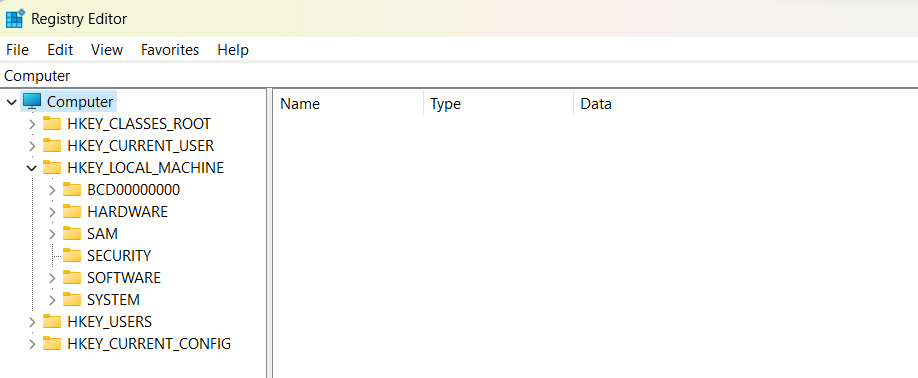

# WINDOWS FORENSIC

## Introduction

Hệ điều hành Windows là sản phẩm của Microsoft, được sử dụng rộng rãi cho máy tính cá nhân cũng như máy chủ doanh nghiệp. Trong lĩnh vực điều tra pháp y số, Windows cung cấp nhiều nguồn dữ liệu quý giá có thể giúp tái hiện quá trình hoạt động, xác định dấu vết tấn công và phục hồi dữ liệu bị xóa.
Có 2 dòng Windows thường được sử dụng. Đó là:

1. Windows: Thường được dùng nhiều trong máy tính cá nhân.
2. Windows Server: Thường được dùng nhiều làm máy chủ cho các doanh nghiệp để: Host Website, tạo và quản lý domain,.....

## Version

Các phiên bản phổ biến của Windows:

- Windows 10, Windows 11: Là những phiên bản phổ biến hiện nay
- Windows 7, Windows XP: Từng được sử dụng phổ biến nhưng đã kết thúc vòng đời và nhiều phần cứng mới yêu cầu hệ điều hành phiên bản cao hơn nên đần ít dùng

## Somethings

### Registry

Registry là kho lưu trữ cấu hình và cài đặt hệ thống. Đây là nguồn dữ liệu chứa rất nhiều thông tin chi tiết về hành vi của hệ thống và người dùng.

#### Vị trí lưu trữ

```powershell
C:\Windows\System32\Config
C:\Users\<Username>\NTUser.dat
```

#### Các hive và tệp cần lưu ý

- **SOFTWARE**: Chứa thông tin về phần mềm cài đặt, phiên bản cài đặt của ứng dụng
- **SYSTEM**: Chứa dữ liệu về cấu hình phần cứng, dịch vụ hệ thống và driver.
- **DEFAULT**: Lưu trữ cấu hình mặc định cho tài khoản người dùng chưa đăng nhập.
- **SAM**: Lưu trữ thông tin về tài khoản người dùng và nhóm, rất quan trọng trong phân tích an ninh.
- **SECURITY**: Lưu trữ các chính sách bảo mật, thông tin về quyền truy cập và xác thực.
- **NTUser.dat**: Cấu hình và cài đặt cá nhân của người dùng, bao gồm lịch sử truy cập, ứng dụng sử dụng, và tùy chỉnh môi trường.

  

- HKEY_CLASSES_ROOT (HKCR): mô tả loại file, phần mở rộng cũng như Object Linking và OLE.
- HKEY_CURRENT_USER (HKCU): Lưu trữ thông tin và cài đặt của người dùng hiện tại.
- HKEY_LOCAL_MACHINE (HKLM): Thông tin cấu hình cho cả hardware, software, drives và hệ thống, mọi user đăng nhập vào máy đều có thể truy cập vào HKLM.
- HKEY_USERS (HKU): Lưu trữ tất cả dữ liệu của người dungf. trong hệ thống.
- HKEY_CURRENT_CONFIG (HKCC): Chứa thông tin chi tiết về cấu hình phần cứng hiện đang gắn vào thiết bị.

#### Công cụ sử dụng

- **RegRipper**: Công cụ dòng lệnh hỗ trợ trích xuất và phân tích tự động các hive.
- **Registry Explorer**: Giao diện trực quan cho phép duyệt, tìm kiếm và so sánh các phiên bản registry khác nhau.
- **Regedit**: Công cụ chỉnh sửa mặc định của Windows, thường dùng cho các thay đổi thủ công hoặc kiểm tra nhanh.

#### Các key quan trọng

`HKCU\SOFTWARE\Microsoft\Windows\CurrentVersion\Explorer (nằm trong file NTUser.dat)`

|             key             |                                      value                                       |
| :-------------------------: | :------------------------------------------------------------------------------: |
| \ComDlg32\LastVistedPidlMRU |         Theo dõi ứng dụng mà người dùng đã sử dụng để mở và lưu tệp tin          |
|  \ComDlg32\OpenSavePidlMRU  |                        Theo dõi tệp tin đã được truy cập                         |
|        \Mountpoints2        |                   Chứa dữliệu về các removable devices (USB,…)                   |
|         \RecentDocs         |                   Chứa thông tin về các file truy cập gần đây                    |
|           \RunMRU           |          Lưu trữ lịch sử các lệnh đã nhập trong hộp thoại "Start →Run"           |
|         \TypedPaths         | Theo dõi các đường dẫn mà người dùng đã nhập thủ công vào thanh địa chỉ Explorer |
|         \UserAssist         |       Ghi lại thông tin về việc thực thi các chương trình giao diện đồ họa       |
|       \WordWheelQuery       |                Chứa thông tin liên quan đến truy vấn và tìm kiếm                 |

`HKCU\SOFTWARE\Microsoft\Windows\CurrentVersion\Run`

Chức năng: Chứa danh sách các chương trình sẽ tự động khởi chạy khi người dùng hiện tại đăng nhập vào hệ thống.
Note: Ảnh hưởng chỉ đến người dùng hiện tại.

`HKLM\SOFTWARE\Microsoft\Windows\CurrentVersion\Run:`

Chức năng: Chứa danh sách các chương trình sẽ tự động khởi chạy khi mọi người dùng đăng nhập vào hệ thống.
Note: Ảnh hưởng đến tất cả người dùng.

`HKLM\SYSTEM\CurrentControlSet\Enum\USB` : Lưu trữ thông tin về thiết bị USB bao gồm Vendor ID (VID) và Product ID (PID).

`HKLM\SYSTEM\MountedDevices`: Lưu trữ thông tin về các thiết bị được gắn kết và liên kết với các ổ đĩa và Volume GUID.

`HKLM\SYSTEM\CurrentControlSet\Control\TimeZoneInformation` : Chứa thông tin về cài đặt múi giờ của hệ thống

`HKLM\SYSTEM\CurrentControlSet\Control\ComputerName\ComputerName` : Chứa tên máy tính của hệ thống

`HKLM\SOFTWARE\Microsoft\Windows NT\CurrentVersion\ProfileList` : Chứa thông tin về các tài khoản người dùng cục bộ.

`HKLM\SYSTEM\CurrentControlSet\services\Tcpip\Parameters\Interfaces`: Chứa thông tin cấu hình về các interfaces như địa chỉ IP, domain…

`HKLM\SYSTEM\CurrentControlSet\Control\Session Manager\AppCompatCache`: Lưu trữ thông tin về các ứng dụng đã chạy, thường được sử dụng để giám sát các tệp tin đã thực thi trước đó.

`HKLM\SYSTEM\CurrentControlSet\Control\Session Manager\Memory Management\PrefetchParameters`: Quản lý việc prefetching trong hệ thống, làm tăng hiệu suất khi khởi động ứng dụng và hệ thống
EnablePrefetcher Key:

- 0 = Disabled
- 1 = Application prefetching enabled
- 2 = Boot prefetching enabled (chỉ áp dụng trên Windows 2003)
- 3 = Application và Boot prefetching enabled (mặc định).  
`HKEY_LOCAL_MACHINE\SAM\Domains\Account`: Chứa thông tin về tài khoản người dùng và nhóm trên hệ thống  
`HKEY_LOCAL_MACHINE\SAM\Domains\Users`: Chứa thông tin chi tiết về các tài khoản người dùng, bao gồm SID (Security Identifier), mật khẩu băm (hash), và các thông tin khác  

### Browser

Trình duyệt web là nơi mà người dùng có thể truy cập vào các website. Đây là nơi chúng ta có thể điều tra để thu thập các thông tin liên quan đến forensics.

#### Dữ liệu và vị trí lưu trữ

- **Chrome**: `%LocalAppData%\Google\Chrome\User Data\Default`
  Bảng dưới đây sẽ đưa ra một số file quan trọng trong forensics trình duyệt Chrome
  | Info | Path |
  | -------------------------------- | -------------------------------------------------------------- |
  | User Profile | %LocalAppData%\Google\Chrome\User Data\Default\* |
  | History (SQLite Database) | %LocalAppData%\Google\Chrome\User Data\Default\History |
  | Cookies (SQLite Database) | %LocalAppData%\Google\Chrome\User Data\Default\Network\Cookies |
  | Cache | %LocalAppData%\Google\Chrome\User Data\Default\Cache\* |
  | Sessions | %LocalAppData%\Google\Chrome\User Data\Default\Sessions\* |
  | Settings and Other Configuration | %LocalAppData%\Google\Chrome\User Data\Default\Preferences |
- **Firefox**: `C:\Users\<Username>\AppData\Roaming\Mozilla\Firefox\Profiles`
- **Edge**: `C:\Users\<Username>\AppData\Local\Microsoft\Edge\User Data\[Default/ProfileX]`
  Bảng dưới đây sẽ đưa ra một số file quan trọng trong forensics trình duyệt Edge
  | Info | Path |
  | -------------------------------- | --------------------------------------------------------------------------- |
  | User Profile | %LocalAppData%\Microsoft\Edge\User Data\[Default/Profile X]\* |
  | History (SQLite Database) | %LocalAppData%\Microsoft\Edge\User Data\[Default/Profile X]\History |
  | Cookies (SQLite Database) | %LocalAppData%\Microsoft\Edge\User Data\[Default/Profile X]\Network\Cookies |
  | Cache | %LocalAppData%\Microsoft\Edge\User Data\[Default/Profile X]\Cache\* |
  | Sessions | %LocalAppData%\Microsoft\Edge\User Data\[Default/Profile X]\Sessions\* |
  | Settings and Other Configuration | %LocalAppData%\Microsoft\Edge\User Data\[Default/Profile X]\Preferences |

#### Công cụ sử dụng

- **Browser History Viewer**: Xem và phân tích lịch sử duyệt web một cách trực quan.
- **Web Browser Forensics Tool**: Công cụ chuyên dụng để trích xuất và phân tích các dữ liệu duyệt web.
- **FTK Imager & Autopsy**: Công cụ forensics mạnh mẽ để tạo bản sao ổ đĩa và phân tích toàn bộ hệ thống.

### OST/PST file

OST và PST là những file sẽ lưu mail, attachments, notes và những dữ liệu có liên quan đến Microsoft Outlook.

|              | OST                                                                                                                                                              | PST                                                                                                                                                  |
| ------------ | ---------------------------------------------------------------------------------------------------------------------------------------------------------------- | ---------------------------------------------------------------------------------------------------------------------------------------------------- |
| Tác dụng     | OST (Offline Storage Table) cho phép người dùng có thể làm việc offline và dữ liệu sẽ được tự động synchronised với Exchange Server khi có kết nối mạng trở lại. | PST (Personal Storage Table) được dùng để lưu trữ các data như bản copy mail, contacts, thông tin liên quan đến Outlook account,… trên local machine |
| Được tạo khi | OST được tạo khi người dùng config Outlook với caching exchange mode                                                                                             | PST được tạo khi người dùng tạo file Outlook data mới                                                                                                |
| Kích thước   | Kích thước lớn hơn                                                                                                                                               | Kích thước nhỏ hơn (giới hạn về độ lớn tùy thuộc vào phiên bản Outlook đang sử dụng)                                                                 |

File OST được tìm thấy ở: `%USERPROFILE%\AppData\Local\Microsoft\Outlook`

#### Công cụ:

Kernel OST Viewer: Dùng để đọc các file OST

---
